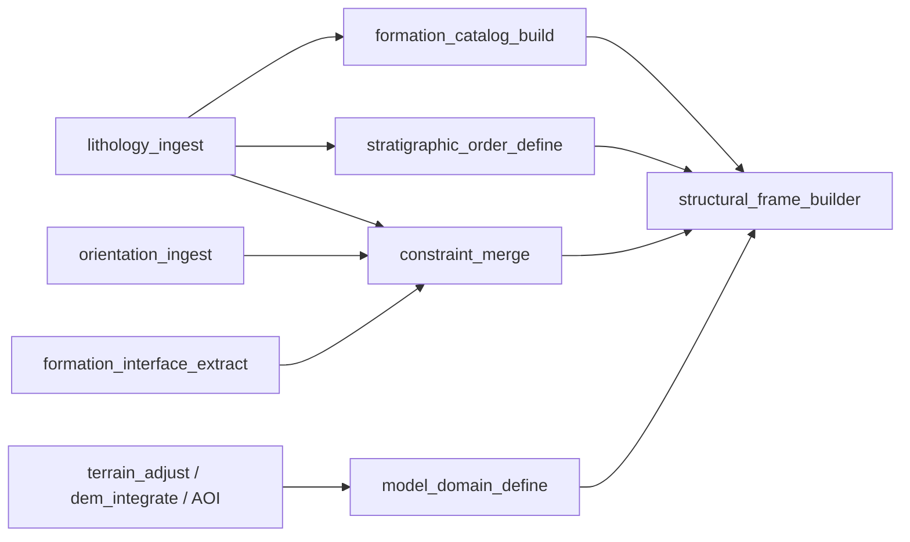

# GemPy-Inspired Underground Modelling
# Milestone 1 Implementation Spec

This document turns the roadmap into a build-ready phase-1 specification.

It focuses on the first deliverable slice:

- explicit formation semantics
- explicit orientations
- explicit model domain
- merged interpolation constraints
- structural frame assembly

This is the point where we stop treating geology as loose geometry and start treating it as a formal modelling dataset.

## Phase 1 Goal

At the end of Milestone 1, we should be able to produce these artifacts reliably:

1. `geology.formation_catalog.v1`
2. `geology.stratigraphic_order.v1`
3. `geology.formation_orientations.v1`
4. `geology.model_domain.v1`
5. `geology.interpolation_constraints.v1`
6. `geology.structural_frame.v1`

And these nodes should exist and run:

1. `formation_catalog_build`
2. `stratigraphic_order_define`
3. `orientation_ingest`
4. `model_domain_define`
5. `constraint_merge`
6. `structural_frame_builder`

## What Ships In This Milestone

### Included

- formation identity and normalization
- ordering metadata
- direct orientation ingestion
- model extent and resolution definition
- a merged constraints artifact
- a structural frame artifact
- validation-level diagnostics embedded in contracts

### Not Yet Included

- actual interpolation
- fault displacement
- horizon extraction
- closed volumes
- TensorFlow backend
- probabilistic workflows

## Recommended Node Order

Implement in this order:

1. `formation_catalog_build`
2. `stratigraphic_order_define`
3. `orientation_ingest`
4. `model_domain_define`
5. `constraint_merge`
6. `structural_frame_builder`

This order matters because each node reduces ambiguity for the next one.

## Phase 1 Graph Shape



Notes:

- `formation_interface_extract` already exists and should be reused.
- `lithology_ingest` already exists and is part of the input path.
- `model_domain_define` should consume AOI and terrain if present, but must also work from raw geometry extents.

## Contract Specifications

These are the target shapes for the new contracts. They should follow the same style as the current `contracts/geology/*.schema.json` files.

## 1. `geology.formation_catalog.v1`

Purpose:
Canonical list of formations and aliases used by the workspace/model.

Primary consumers:

- `stratigraphic_order_define`
- `constraint_merge`
- `structural_frame_builder`
- viewer palette binding later

Suggested top-level shape:

```json
{
  "schema_id": "geology.formation_catalog.v1",
  "schema_version": 1,
  "crs": { "epsg": 32615 },
  "formations": [
    {
      "formation_id": "chan_01",
      "name": "Channel Sand",
      "canonical_name": "Channel Sand",
      "group": "sediments",
      "aliases": ["CHAN_SAND", "channel_sand"],
      "lithology_codes": ["CS"],
      "is_basement": false,
      "attributes": {}
    }
  ],
  "normalization": {
    "case_sensitive": false,
    "trim_whitespace": true
  },
  "provenance": {}
}
```

Required fields:

- `schema_id`
- `schema_version`
- `formations`

Required formation fields:

- `formation_id`
- `name`
- `canonical_name`

Important notes:

- `formation_id` should be workspace-stable and safe for joins.
- `canonical_name` is the normalized value downstream nodes should use.
- `group` is optional now but very useful later.

## 2. `geology.stratigraphic_order.v1`

Purpose:
Explicit ordered stack of formations for one or more structural groups.

Primary consumers:

- `constraint_merge`
- `structural_frame_builder`
- `stratigraphic_interpolator` later

Suggested shape:

```json
{
  "schema_id": "geology.stratigraphic_order.v1",
  "schema_version": 1,
  "groups": [
    {
      "group_id": "sediments",
      "group_name": "Sediments",
      "relation_type": "conformable",
      "formations_top_to_bottom": [
        "soil",
        "alluvium",
        "channel_sand",
        "shale"
      ]
    }
  ],
  "global_order_top_to_bottom": [
    "soil",
    "alluvium",
    "channel_sand",
    "shale",
    "basement"
  ],
  "provenance": {}
}
```

Required fields:

- `groups`

Required group fields:

- `group_id`
- `formations_top_to_bottom`

Rules:

- order direction must always be top-to-bottom
- every formation listed here should exist in `formation_catalog`
- duplicates in one group should be invalid

## 3. `geology.formation_orientations.v1`

Purpose:
Store dip/azimuth or pole-vector observations with provenance and confidence.

Primary consumers:

- `constraint_merge`
- `structural_frame_builder`
- interpolation later

Suggested shape:

```json
{
  "schema_id": "geology.formation_orientations.v1",
  "schema_version": 1,
  "crs": { "epsg": 32615 },
  "orientations": [
    {
      "orientation_id": "ori_0001",
      "formation": "channel_sand",
      "group": "sediments",
      "x": 500123.2,
      "y": 4412345.8,
      "z": 126.4,
      "dip_deg": 18.5,
      "azimuth_deg": 132.0,
      "polarity": "normal",
      "pole_vector": [0.21, -0.31, 0.93],
      "source_kind": "observed",
      "confidence": 0.95,
      "attributes": {},
      "qa_flags": []
    }
  ],
  "provenance": {}
}
```

Required orientation fields:

- `orientation_id`
- `formation`
- `x`
- `y`
- `z`

At least one of:

- `dip_deg` + `azimuth_deg`
- `pole_vector`

Rules:

- downstream code should normalize to `pole_vector`
- `source_kind` should allow: `observed`, `derived_surface`, `derived_interval`, `inferred`
- `confidence` should be `0..1`

## 4. `geology.model_domain.v1`

Purpose:
Canonical modelling extent, z-range, and resolution hints.

Primary consumers:

- `structural_frame_builder`
- interpolation later
- mesh extraction later

Suggested shape:

```json
{
  "schema_id": "geology.model_domain.v1",
  "schema_version": 1,
  "crs": { "epsg": 32615 },
  "bounds": {
    "xmin": 499000.0,
    "xmax": 503000.0,
    "ymin": 4410000.0,
    "ymax": 4414000.0,
    "zmin": -800.0,
    "zmax": 250.0
  },
  "grid_strategy": {
    "mode": "regular",
    "nx": 80,
    "ny": 80,
    "nz": 60
  },
  "topography": {
    "source_artifact_key": "graphs/.../dem_surface.json",
    "clip_mode": "mask_above_topography"
  },
  "padding": {
    "xy_percent": 5.0,
    "z_percent": 10.0
  },
  "provenance": {}
}
```

Required fields:

- `crs`
- `bounds`
- `grid_strategy`

Rules:

- `bounds` must already include padding
- `grid_strategy.mode` should support at least `regular`
- leave room for `octree` later without changing the schema family

## 5. `geology.interpolation_constraints.v1`

Purpose:
Merged modelling constraints artifact that packages contacts + orientations in one place.

Primary consumers:

- `structural_frame_builder`
- interpolation later

Suggested shape:

```json
{
  "schema_id": "geology.interpolation_constraints.v1",
  "schema_version": 1,
  "crs": { "epsg": 32615 },
  "contacts": [
    {
      "constraint_id": "con_001",
      "formation": "channel_sand",
      "contact_kind": "top",
      "formation_above": "alluvium",
      "formation_below": "channel_sand",
      "x": 500100.0,
      "y": 4412200.0,
      "z": 95.2,
      "source_kind": "drillhole_interval",
      "confidence": 0.98,
      "qa_flags": []
    }
  ],
  "orientations": [
    {
      "constraint_id": "ori_001",
      "formation": "channel_sand",
      "x": 500123.2,
      "y": 4412345.8,
      "z": 126.4,
      "pole_vector": [0.21, -0.31, 0.93],
      "source_kind": "observed",
      "confidence": 0.95,
      "qa_flags": []
    }
  ],
  "diagnostics": {
    "formation_counts": {},
    "warnings": []
  },
  "provenance": {}
}
```

Required fields:

- `contacts`
- `orientations`

Notes:

- This contract is intentionally compute-facing.
- It should contain normalized formation names only.
- Diagnostics should include missing orientation coverage by formation.

## 6. `geology.structural_frame.v1`

Purpose:
Canonical structural modelling definition, equivalent to the semantic role GemPy’s structural frame plays.

Primary consumers:

- interpolation later
- horizon extraction later
- viewer packaging later

Suggested shape:

```json
{
  "schema_id": "geology.structural_frame.v1",
  "schema_version": 1,
  "formations": [
    {
      "formation_id": "channel_sand",
      "name": "Channel Sand",
      "group_id": "sediments",
      "order_index": 2,
      "is_active": true
    }
  ],
  "groups": [
    {
      "group_id": "sediments",
      "group_name": "Sediments",
      "relation_type": "conformable",
      "formations_top_to_bottom": [
        "soil",
        "alluvium",
        "channel_sand",
        "shale"
      ]
    }
  ],
  "constraints_ref": {
    "schema_id": "geology.interpolation_constraints.v1"
  },
  "domain_ref": {
    "schema_id": "geology.model_domain.v1"
  },
  "diagnostics": {
    "warnings": [],
    "errors": []
  },
  "provenance": {}
}
```

Required fields:

- `formations`
- `groups`

Rules:

- one formation belongs to one active group in phase 1
- relation types should support at least: `conformable`, `unconformity`, `faulted`
- phase 1 may reject `faulted` groups during validation, but the enum should exist

## Node Specifications

These are the first nodes we should actually scaffold in Rust.

## 1. `formation_catalog_build`

Purpose:
Produce the canonical formation list and normalization map.

Inputs:

- `lithology_intervals_in` -> `geology.lithology_intervals.v1`
- optional `formation_aliases_in` later

Outputs:

- `formation_catalog_out` -> `geology.formation_catalog.v1`

Config:

- `case_sensitive: bool`
- `trim_whitespace: bool`
- `alias_map: object`
- `basement_names: string[]`

Runtime behavior:

- read all interval formation names
- normalize according to config
- create stable ids
- preserve raw names in aliases where useful
- mark basement-like formations if configured

Why separate:

- this artifact is reusable by many later nodes
- normalization should not be hidden inside every downstream node

## 2. `stratigraphic_order_define`

Purpose:
Emit explicit formation order from config and/or lithology evidence.

Inputs:

- `formation_catalog_in` -> `geology.formation_catalog.v1`
- optional `lithology_intervals_in` -> `geology.lithology_intervals.v1`

Outputs:

- `stratigraphic_order_out` -> `geology.stratigraphic_order.v1`

Config:

- `global_order_top_to_bottom: string[]`
- optional `groups`
- `infer_if_missing: bool`

Runtime behavior:

- prefer explicit config
- if `infer_if_missing`, derive order from drillhole transitions and emit warnings
- reject formations not found in the catalog

Why separate:

- order is a semantic modelling decision, not just a byproduct of interval parsing

## 3. `orientation_ingest`

Purpose:
Map CSV or structured orientation data into canonical orientation observations.

Inputs:

- `table_in` -> mapped CSV/JSON
- optional `formation_catalog_in`

Outputs:

- `formation_orientations_out` -> `geology.formation_orientations.v1`

Config:

- column mapping for `formation`, `x`, `y`, `z`, `dip_deg`, `azimuth_deg`, `pole_vector`
- `source_kind`
- `default_confidence`

Runtime behavior:

- normalize formations through the catalog if present
- compute pole vector if only dip/azimuth provided
- validate numeric ranges

Why separate:

- orientation ingestion is a core modelling primitive analogous to GemPy orientation inputs

## 4. `model_domain_define`

Purpose:
Emit canonical model bounds and resolution hints.

Inputs:

- optional `aoi_in` -> `spatial.aoi.v1`
- optional `terrain_in` -> `terrain.surface_grid.v1`
- optional `interface_points_in` -> `geology.interface_points.v1`
- optional `orientations_in` -> `geology.formation_orientations.v1`

Outputs:

- `model_domain_out` -> `geology.model_domain.v1`

Config:

- `padding_xy_percent`
- `padding_z_percent`
- `grid_mode`
- `nx`, `ny`, `nz`
- `clip_to_topography`
- optional explicit z overrides

Runtime behavior:

- union bounds from available inputs
- add padding
- derive z-range conservatively from terrain + subsurface evidence
- optionally attach topography reference

Why separate:

- the domain should be explicit and inspectable before any interpolation

## 5. `constraint_merge`

Purpose:
Produce one compute-facing constraints artifact for the structural model.

Inputs:

- `interface_points_in` -> `geology.interface_points.v1`
- optional `orientations_in` -> `geology.formation_orientations.v1`
- `formation_catalog_in` -> `geology.formation_catalog.v1`
- optional `stratigraphic_order_in`

Outputs:

- `constraints_out` -> `geology.interpolation_constraints.v1`

Config:

- `min_orientations_per_formation`
- `allow_missing_orientations`
- `drop_unknown_formations`

Runtime behavior:

- normalize all formations
- merge contacts and orientations
- collect counts by formation
- emit warnings for missing orientation coverage

Why separate:

- interpolation later should depend on one canonical constraints artifact

## 6. `structural_frame_builder`

Purpose:
Assemble the semantic modelling definition from catalog, order, domain, and constraints.

Inputs:

- `formation_catalog_in`
- `stratigraphic_order_in`
- `constraints_in`
- `model_domain_in`

Outputs:

- `structural_frame_out` -> `geology.structural_frame.v1`

Config:

- optional manual group definitions
- relation types per group
- inactive formations list

Runtime behavior:

- build groups and ordered formations
- attach references/diagnostics
- validate orphan formations and ordering gaps

Why separate:

- this is the final semantic assembly step before actual interpolation

## Port Conventions

Suggested port names for consistency:

- `formation_catalog_in` / `formation_catalog_out`
- `stratigraphic_order_in` / `stratigraphic_order_out`
- `formation_orientations_in` / `formation_orientations_out`
- `model_domain_in` / `model_domain_out`
- `constraints_in` / `constraints_out`
- `structural_frame_in` / `structural_frame_out`

For ingestion-style CSV nodes:

- keep `table_in`
- emit one canonical contract out port

## Registry / UI Work Needed

For each of the six nodes above:

- add node-registry entry in `services/orchestrator/src/node-registry.json`
- add executor wiring in `crates/mine-eye-nodes`
- add AI-chat planning fragments
- add viewer/scene contract support only if the artifact is directly visualizable
- add Node Inspector mapping UI where the node ingests tabular data

Phase 1 visibility guidance:

- `orientation_ingest` can be visualized as points or orientation glyph anchors later
- `model_domain_define` can optionally emit AOI-like bounds for debug
- `constraint_merge` and `structural_frame_builder` are primarily inspect/debug artifacts, not viewer layers

## Minimal Validation Rules

These should exist in the node implementations, even before we add a dedicated validator node.

### `formation_catalog_build`

- reject blank canonical formation names
- stable `formation_id` generation

### `stratigraphic_order_define`

- reject duplicate formations in one group
- reject formations missing from the catalog

### `orientation_ingest`

- reject invalid dip/azimuth ranges
- reject zero-length pole vectors

### `model_domain_define`

- reject non-positive extents
- reject invalid resolution values

### `constraint_merge`

- warn on formations with contacts but no orientations
- warn on unknown formations

### `structural_frame_builder`

- reject empty group definitions
- reject order gaps
- warn on inactive formations that still appear in constraints

## Suggested Test Fixtures

We should add tiny deterministic fixtures for:

1. Single-stack conformable stratigraphy with 3 formations
2. Orientation CSV with dip/azimuth only
3. Orientation CSV with pole vectors only
4. Missing-orientation formation case
5. Explicit model domain override case

These fixtures should let us unit-test each node independently before we wire interpolation.

## First Scaffolding Tasks

This is the exact implementation checklist I would start from in code:

- [ ] Add six new schema JSON files under `contracts/geology/`
- [ ] Register schema ids in any contract classification logic that needs them
- [ ] Add `orientation_ingest` node skeleton
- [ ] Add `formation_catalog_build` node skeleton
- [ ] Add `stratigraphic_order_define` node skeleton
- [ ] Add `model_domain_define` node skeleton
- [ ] Add `constraint_merge` node skeleton
- [ ] Add `structural_frame_builder` node skeleton
- [ ] Wire node kinds into `mod.rs`, `executor.rs`, `lib.rs`
- [ ] Add orchestrator registry entries
- [ ] Add Node Inspector support for `orientation_ingest`
- [ ] Add AI-chat prompts/fragments for the new node family
- [ ] Add minimal fixture-based tests per node

## Recommended Split Across Rust Modules

To keep things tidy:

- put `formation_catalog_build`, `stratigraphic_order_define`, `constraint_merge`, and `structural_frame_builder` into a new `stratigraphy.rs` or `modelling.rs`
- put `orientation_ingest` into `acquisition.rs`
- put `model_domain_define` into `terrain.rs` or a new `domain.rs`

That keeps:

- ingestion-like tabular mapping near acquisition
- semantic modelling assembly near stratigraphy
- domain logic near terrain/AOI logic

## Exit Condition For Milestone 1

Milestone 1 is done when:

1. We can ingest lithology + orientations + terrain/AOI
2. We can emit the six canonical phase-1 contracts
3. We can inspect those artifacts in the graph without ambiguity
4. The structural frame artifact is sufficient to hand to a later interpolator node without redesign

When those conditions are met, we can start Milestone 2 interpolation work without guessing at the semantic model again.
